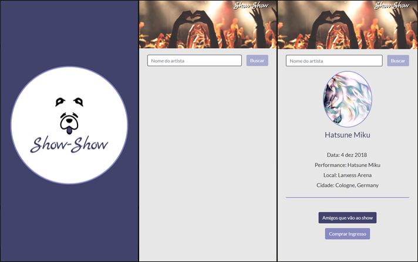

# Show-Show

## Motivo
Este é o MVP (mínimo produto viável) do desafio do primeiro hackathon do bootcamp Laboratoria.

Em aproximadamente 7 horas de hackaton, trabalhamos em squads de 6 estudantes deveriamos criar um aplicativo relativo ao mundo da música ou entretenimento usando uma API. Meu time escolheu a API da Songkick para fazermos um centralizador de shows onde as pessoas conseguissem buscar qualquer artista e descobrir os locais e datas dos próximos shows. 

Realizamos o planejamento através do Trello: https://trello.com/b/yoM9gEwM/show-show-%F0%9F%90%B6

Utilizamos técnicas de UX: Wireframe, criação de Personas e o protótipo usando Adobe XD.

https://docs.google.com/document/d/1brk4wyZ_fn3tAd7XChD2dkF0hPL4v8iH05dEUjfT4R4/edit?usp=sharing

https://xd.adobe.com/view/98583652-de5f-4f55-7e41-7770202201ed-ee69/

Houve a criação da logotipo do produto através do Photoshop.

Criamos a apresentação (Pitch) em Slides utilizando o Google Apresentações.

https://docs.google.com/presentation/d/1gpSxiCqdmwLlufURBRTKIiY2QDohJEeCAhhk1UfwSSY/edit#slide=id.g3ebc3b650b_0_15

## Aparência

